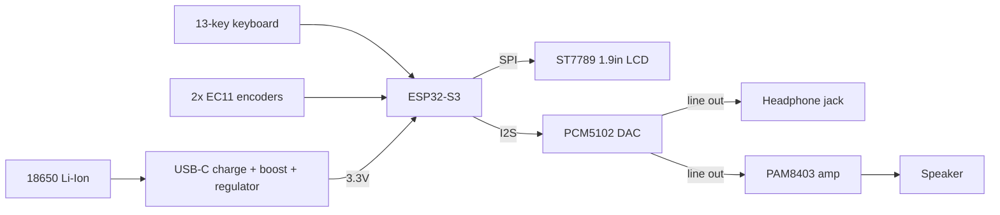
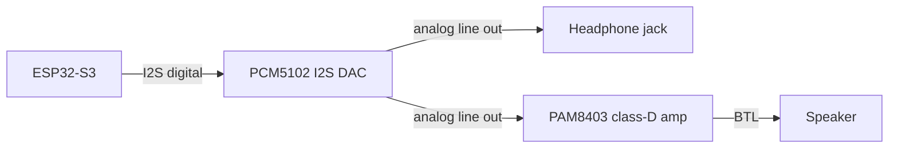

# Pocket Groovebox — Hardware

> I2S DAC (PCM5102) and SPI display (ST7789) are verified and wired. Encoder and keyboard wiring is TBD — pending the input method decision in [explorations/0001-input-method.md](../explorations/0001-input-method.md).

Hardware decisions for the device. For the *why* and *what*, see [brief.md](../brief.md); for build steps, see [plan.md](../plan.md).

> **DIY constraint.** These choices follow the brief's "Open, DIY hardware" principle: every part is an accessible, off-the-shelf maker module (breakout boards, common dev boards, standard cells) that anyone can source and rebuild — no custom silicon, no specialized fabrication. Enclosure and mechanical parts lean on home-friendly techniques (3D printing, laser-cut/CNC acrylic, repurposed toy instruments, robotics kits). When weighing a component, prefer the one that keeps the build reproducible.

## Hardware platform

**ESP32-S3** for both prototyping and V1. It has the RAM, CPU, BLE MIDI, and native USB to run standalone audio and DSP — and it's preferred over a Raspberry Pi (faster boot, lower power, smaller, cheaper) for a battery-powered instrument.

## Diagrams

> **Diagram convention.** Block/flow diagrams use **Mermaid** (rendered inline on GitHub) for design-time "what connects to what" — easy to edit as the design changes. Detailed, image-based wiring comes later for the build tutorial and per-module docs, drawn in **Fritzing** (breadboard view) and exported as **SVG** for crisp, properly licensed visuals.

### System overview

### Audio chain

Note: both the PAM8403 and the MAX98357A are BTL (bridge-tied) speaker amps and cannot drive headphones directly — headphone/line out comes from the PCM5102.

## Component selection

| Area | Choice | Notes |
| --- | --- | --- |
| MCU | ESP32-S3 | More RAM/CPU, BLE MIDI, native USB |
| Keyboard | 13 keys (8 white + 5 black) | One octave, nanoKEY2-style mini keys |
| Display | 1.9" ST7789 LCD, 170×320 SPI | BPM, presets, waveforms, menus |
| Controls | 2× EC11 rotary encoders | Volume, navigation, BPM, sound/params |
| Audio | PCM5102 I2S DAC + PAM8403 amp | DAC line out → headphone; amp → speaker. MAX98357A is a compact mono alternative. |
| Power | 1× 18650 Li-Ion | USB-C charging → boost → 5V → 3.3V |
| Storage | Internal flash | Built-in synth/sounds; microSD added later if needed |
| PCB | KiCad | ESP32-S3 + USB-C + charger + display + amp + encoders + key matrix |

Most of these parts are already on hand. Each module gets its own doc (pinout, photos, wiring, source) under [`modules/`](modules/) — copy [`modules/module-template.md`](modules/module-template.md) per part as you bench-test it. Pin-by-pin connections between modules are in [wiring.md](wiring.md).

## Power architecture

Single cell, not two: simpler, safer, smaller, and lower cost.

## Tools

Bench tools and consumables needed to build and debug the device (not part of the device itself). To be filled in from actual purchases.

| Tool | Purpose | On hand |
| --- | --- | --- |
| Soldering iron | Assembling modules and headers | — |
| Solder + flux | Joints | — |
| Multimeter | Continuity, voltage, current checks | — |
| _(send your list)_ | | |
