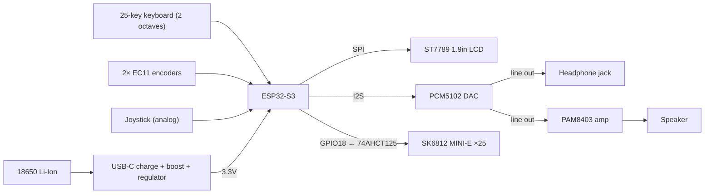
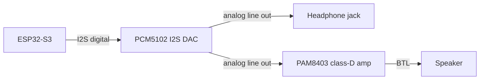
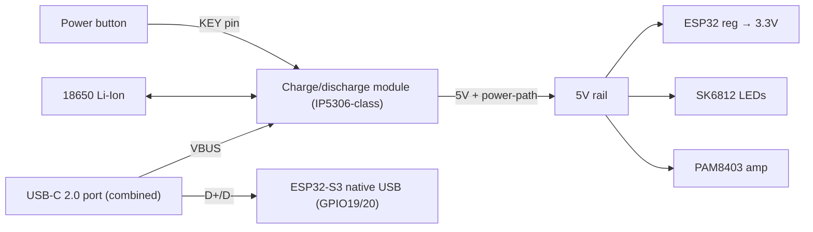

# Pocket Groovebox — Hardware

> I2S DAC (PCM5102) and SPI display (ST7789) are verified and wired. EC11 encoders and joystick are on hand but not yet wired. Keyboard wiring is TBD — pending the lever bridge design. Input method decision: **mechanical keys** ([0002-key-design.md](../explorations/0002-key-design.md)).

Hardware decisions for the device. For the *why* and *what*, see [brief.md](../brief.md); for build steps, see [plan.md](../plan.md).

> **DIY constraint.** These choices follow the brief's "Open, DIY hardware" principle: every part is an accessible, off-the-shelf maker module (breakout boards, common dev boards, standard cells) that anyone can source and rebuild — no custom silicon, no specialized fabrication. Enclosure and mechanical parts lean on home-friendly techniques (3D printing, laser-cut/CNC acrylic, repurposed toy instruments, robotics kits). When weighing a component, prefer the one that keeps the build reproducible.

## Hardware platform

**ESP32-S3** for both prototyping and V1. It has the RAM, CPU, BLE MIDI, and native USB to run standalone audio and DSP — and it's preferred over a Raspberry Pi (faster boot, lower power, smaller, cheaper) for a battery-powered instrument.

## Diagrams

> **Diagram convention.** Block/flow diagrams use **Mermaid** (rendered inline on GitHub) for design-time "what connects to what" — easy to edit as the design changes. Detailed, image-based wiring comes later for the build tutorial and per-module docs, drawn in **Fritzing** (breadboard view) and exported as **SVG** for crisp, properly licensed visuals.

### System overview

### Audio chain

Note: both the PAM8403 and the MAX98357A are BTL (bridge-tied) speaker amps and cannot drive headphones directly — headphone/line out comes from the PCM5102.

## Component selection

| Area | Choice | Notes |
| --- | --- | --- |
| MCU | ESP32-S3 | More RAM/CPU, BLE MIDI, native USB |
| Keyboard | 25 keys (15 white + 10 black) — 2 octaves | KS-33 Silent Brown MX switches, lever bridge, 18mm pitch, 270mm wide |
| Key I/O | 2× PCF8575 I2C expander (0x20 + 0x21) | 16 + 9 pins for 25 keys; shared INT on GPIO15 (open-drain wired-OR) |
| Key LEDs | SK6812 MINI-E ×25 | Per-key RGB, south-facing MX mount, 74AHCT125 level shifter on GPIO18 |
| Display | 1.9" ST7789 LCD, 170×320 SPI | BPM, presets, waveforms, menus |
| Controls | 2× EC11 rotary encoders + mini joystick | Encoders on JTAG GPIO39–42 + GPIO16/17; joystick role TBD (pitch/expression/menu nav) |
| Audio | PCM5102 I2S DAC + PAM8403 amp | DAC line out → headphone (PJ-320) + amp → speaker |
| Power | 1× 18650 Li-Ion (prototype) | Single charge/discharge module (IP5306-class): USB-C charge → boost → 5V → 3.3V, power-path, **KEY pin = power button**. Final cell *form* (cylindrical 18650 vs flat LiPo) TBD with enclosure layout |
| USB / data | Single combined USB-C 2.0 port | VBUS → charge module; D+/D− → ESP32 native USB (GPIO19/20) for serial + **USB-MIDI**; CC1/CC2 = 5.1 kΩ pulldowns |
| Storage | Internal flash | Built-in synth/sounds; microSD added later if needed |
| PCB | KiCad | ESP32-S3 + USB-C + charger + display + amp + encoders + key matrix |

Each module gets its own doc (pinout, photos, wiring, source) under [`modules/`](modules/). Pin-by-pin connections between modules are in [wiring.md](wiring.md).

## On hand vs sourcing

| Part | Status |
|---|---|
| ESP32-S3 dev board (Waveshare N32R16V) | ✅ On hand |
| PCM5102 DAC · PAM8403 amp (QA03) · ST7789 1.9" display | ✅ On hand |
| EC11 encoder ×2 · joystick (analog) · protoboard ×2 | ✅ On hand |
| Dupont jumpers | ✅ On hand |
| KS-33 Silent Brown switches ×35 | 🛒 Ordered |
| SK6812 MINI-E ×50 | 🛒 Ordered |
| Springs 0.4×5×15mm ×20 | 🛒 Ordered |
| 40mm full-range speaker 4Ω ×2 | 🛒 Ordered |
| PCF8575 ×5 (I2C expander) | 🛒 Ordered (1 on hand) |
| 74AHCT125 level shifter | 🛒 Ordered |
| Charge/discharge module (IP5306-class, 5V/2A, power-path, KEY) | 🛒 Ordered |
| USB-C 2.0 breakout (6-pin, CC1/CC2 + 5.1 kΩ) | 🛒 Ordered |
| 18650 holder | 🛒 Ordered |
| EC11 knobs | 🛒 Ordered |
| Hookup wire 24 AWG solid — red/black 10 m, yellow 20 m | 🛒 Ordered |
| Enameled copper wire 0.4 mm 300 g (QA-1 solderable) | 🛒 Ordered |
| Perfboard | 🛒 Ordered |
| Wire stripper (10–30 AWG) | 🛒 Ordered |
| Headphone jack (PJ-320 3.5 mm stereo, ×several) | ❌ To buy |
| Power button (momentary, wired to KEY pin) | ❌ To buy |
| 18650 cell | ❌ To buy — local (AR) |
| Heat-shrink tubing kit | ❌ To buy |
| JST connectors (PH/XH) + crimp tool | ❌ To buy |
| DIP socket (for 74AHCT125) | ❌ To buy |
| Passives — 4.7 kΩ ×3, 330–470 Ω, 0.1 µF, 470–1000 µF, 5.1 kΩ ×2 | ❌ To buy — local (AR) |
| Tweezers · helping hands · desolder braid | ❌ To buy (nice-to-have) |

## Power architecture

A **single USB-C port carries both charging and USB data**. At the connector the lines split: VBUS → the charge/discharge module; D+/D− → the ESP32-S3 native USB (serial + USB-MIDI); CC1/CC2 get 5.1 kΩ pulldowns (sink role).

**Decisions:**
- **Single cell, not two:** simpler, safer, smaller, lower cost. Final cell *form* (cylindrical 18650 vs flat LiPo pouch) is decided with the enclosure interior layout — the module charges either (same Li-ion chemistry).
- **One charge/discharge module** (IP5306-class) does charging + 5V boost + power-path (use while charging) + battery protection in a single board — no separate charger/boost.
- **KEY pin = power button** (single press on / double press off) — no separate power switch.
- **VBUS routes only to the module**, never to the ESP32 5V pin — the ESP32 is always powered from the module's 5V output, so USB plug-in can't backfeed/fight the boost.
- **USB-MIDI requires the native USB** (GPIO19/20); the UART bridge can't do MIDI. The module's own USB-C is power-only and is **not** used for the combined port.
- Battery % via the module's 4-LED indicator, or the ESP32 ADC (voltage divider off the cell) for on-display readout.

## Tools

Bench tools and consumables needed to build and debug the device (not part of the device itself). To be filled in from actual purchases.

| Tool | Purpose | Status |
| --- | --- | --- |
| Soldering iron (65 W, temp-controlled) | Modules, headers, burning enamel off magnet wire | ✅ On hand |
| Multimeter (UNI-T UT89XD) | Continuity, voltage, current checks | ✅ On hand |
| Flush cutters | Trimming leads and wire | ✅ On hand |
| Wire stripper (10–30 AWG) | Stripping 24 AWG hookup wire | 🛒 Ordered |
| Solder + flux | Joints | — |
| Tweezers · helping hands · desolder braid | Fine-wire handling, soldering aid, rework | ❌ Nice-to-have |
