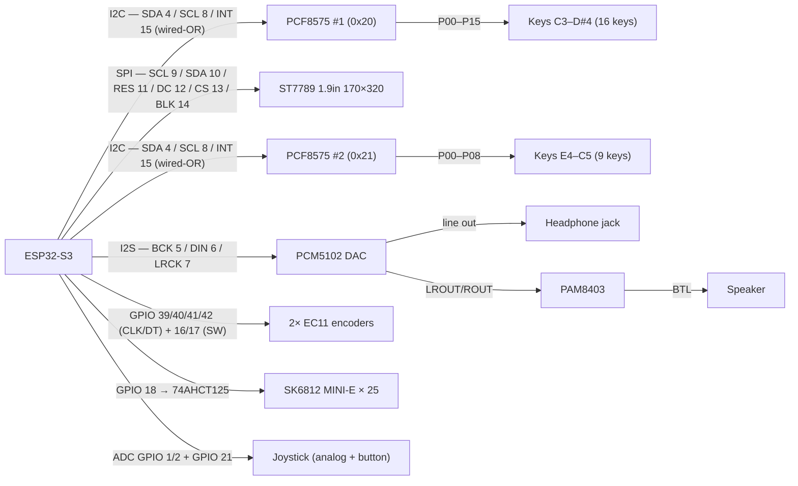

# Pocket Groovebox — Wiring

> 🚧 **Draft — pin choices may change during bench tests.**

How the modules connect to the ESP32-S3. This doc is **only the connection structure** — each module's own specs and pinout live in [modules/](modules/). Pin choices follow the verified-safe 3.3 V GPIO pool documented in [modules/esp32-s3-devkit.md](modules/esp32-s3-devkit.md#gpio-usage-n32r16v).

**Status:**
- ✅ PCM5102 DAC, ST7789 display, PAM8403 amp — verified and wired
- ✅ EC11 encoders and joystick — on hand, wiring defined
- 🚧 Keyboard (25 keys via PCF8575 ×2) — wiring defined, lever bridge mechanism being designed
- 🛒 SK6812 MINI-E LEDs — on order, wiring defined

## Connection overview

## Connections

### PCM5102 — I2S DAC

| ESP32-S3 | PCM5102 |
| --- | --- |
| GPIO5 | BCK (bit clock) |
| GPIO6 | DIN (data) |
| GPIO7 | LRCK / WS |
| 3V3 | VIN / VCC |
| GND | GND |

DAC and display both live on the **left header** — the only side with enough usable GPIOs (the right header has just 3: 1/2/21). BCK·DIN·LCK = GPIO **5·6·7**, same order as the module's header so the wires run straight across; SCK ties to GND. 3V3 and GND are both on the left header, so no power wire has to cross.

Module config: tie **SCK → GND** (internal PLL); set the FLT / DEMP / FMT / XSMT jumpers per the breakout (⚠️ our board's H/L labels are inverted — see [modules/pcm5102.md](modules/pcm5102.md#config-jumpers-solder-pads-back-of-board)).

### PAM8403 — speaker amp

| From | PAM8403 (QA03) |
| --- | --- |
| PCM5102 LROUT | L (audio in) |
| PCM5102 ROUT | R (audio in) |
| PCM5102 AGND | GND (audio in) |
| 5V / VBUS | 5V (+) |
| GND | GND (−) |
| Speaker (4 Ω 3 W, [modules/speaker.md](modules/speaker.md)) | across **L+ / L−** (BTL) |

The amp's input is the **analog line out** of the PCM5102 (LROUT/ROUT), not the I2S signal. **Don't skip `AGND → amp GND`** — the signal ground is as important as the supply ground; without it the amp floats and screams noise at full volume regardless of the digital level (see [modules/pam8403.md](modules/pam8403.md#notes--gotchas)). Output is **BTL** — the speaker floats between L+ and L−; **never tie any `OUT` pad to GND** (it shorts the bridge and can kill the chip), and never connect headphones to the amp (those come off the DAC). Powered from the devkit **5 V / VBUS** pin so the amp, DAC AGND, and ESP32 share one ground. Fixed gain (no pot) — set level via the sketch's `AMPLITUDE`. Pinout and gotchas: [modules/pam8403.md](modules/pam8403.md).

### ST7789 — 1.9" 170×320 SPI display

| ESP32-S3 | ST7789 |
| --- | --- |
| GPIO9 | SCL / SCLK |
| GPIO10 | SDA / MOSI |
| GPIO11 | RES / RST |
| GPIO12 | DC |
| GPIO13 | CS |
| GPIO14 | BLK (backlight) |
| 3V3 | VCC |
| GND | GND |

GPIO **9–14**, assigned in the screen's own header order (SCL·SDA·RES·DC·CS·BLK) so the wires run straight across. SPI is fully remappable on the S3, so the order is a free choice. DAC sits just above at 5/6/7.

Write-only — no MISO. The 170×320 panel needs a driver offset (Arduino_GFX / TFT_eSPI).

### PCF8575 — 16-bit I2C I/O expander (keyboard, 2× chips)

Two PCF8575s share the same I2C bus (SDA/SCL) and a single INT line wired open-drain (wired-OR). Any key press on either chip pulls INT low and wakes the ESP32-S3 interrupt handler, which then reads both chips to resolve which key(s) changed.

**Shared I2C connections (both chips):**

| ESP32-S3 | PCF8575 | Notes |
| --- | --- | --- |
| GPIO4 | SDA | 4.7 kΩ pull-up to 3.3 V (one resistor on the bus is enough) |
| GPIO8 | SCL | 4.7 kΩ pull-up to 3.3 V (one resistor on the bus is enough) |
| GPIO15 | INT | 4.7 kΩ pull-up to 3.3 V; both chips' INT pins wire directly to this GPIO (open-drain wired-OR) |
| 3V3 | VCC | |
| GND | GND | |

**PCF8575 #1 — I2C address 0x20 (A0=A1=A2=GND):**

| PCF8575 pin | Key |
| --- | --- |
| P00 | C3 |
| P01 | C#3 |
| P02 | D3 |
| P03 | D#3 |
| P04 | E3 |
| P05 | F3 |
| P06 | F#3 |
| P07 | G3 |
| P10 | G#3 |
| P11 | A3 |
| P12 | A#3 |
| P13 | B3 |
| P14 | C4 |
| P15 | C#4 |
| P16 | D4 |
| P17 | D#4 |

**PCF8575 #2 — I2C address 0x21 (A0=3V3, A1=A2=GND):**

| PCF8575 pin | Key |
| --- | --- |
| P00 | E4 |
| P01 | F4 |
| P02 | F#4 |
| P03 | G4 |
| P04 | G#4 |
| P05 | A4 |
| P06 | A#4 |
| P07 | B4 |
| P10 | C5 |
| P11–P17 | spare |

Each key is wired between its P-pin and GND. Key pressed = pin reads 0. See [modules/pcf8575.md](modules/pcf8575.md) for pull-up requirements and I2C read protocol.

### EC11 — rotary encoders (×2)

JTAG pins GPIO39–42 are input-only on the ESP32-S3 but usable for encoder CLK/DT (always inputs). This frees all regular GPIOs for outputs and bidirectional use.

| Signal | ESP32-S3 | Notes |
| --- | --- | --- |
| EC11 #1 CLK | GPIO39 | JTAG pin — input-only; enable internal pull-up |
| EC11 #1 DT  | GPIO40 | JTAG pin — input-only; enable internal pull-up |
| EC11 #1 SW  | GPIO16 | regular GPIO; enable internal pull-up |
| EC11 #2 CLK | GPIO41 | JTAG pin — input-only; enable internal pull-up |
| EC11 #2 DT  | GPIO42 | JTAG pin — input-only; enable internal pull-up |
| EC11 #2 SW  | GPIO17 | regular GPIO; enable internal pull-up |

All encoder signals wire encoder pin → ESP32-S3 GPIO; the encoder's common/ground pin ties to GND.

### SK6812 MINI-E — per-key RGB LEDs (×25)

One LED per key, driven from a single GPIO via the ESP32-S3 RMT peripheral. A 74AHCT125 level shifter is mandatory (ESP32-S3 outputs 3.3 V; VIH = 3.5 V at 5 V supply — direct connection is out of spec).

| Signal | Connection |
| --- | --- |
| ESP32-S3 GPIO18 | → 74AHCT125 input (OE pin tied LOW) |
| 74AHCT125 output | → 330–500 Ω series resistor → LED #1 DIN |
| LED #1 DOUT | → LED #2 DIN → … (chain of 25) |
| All LED VDD | 5 V (VBUS) |
| All LED GND | GND |

See [modules/sk6812mini-e.md](modules/sk6812mini-e.md) for full timing, power budget, and level-shifter details.

### Joystick — mini analog thumbstick

Physically included. Role TBD (pitch bend / expression / note selection / menu navigation — to be decided). Axis pins feed ADC1; right-header GPIOs are used to avoid any conflict with ADC2 (which shares resources with Wi-Fi).

| Signal | ESP32-S3 | Notes |
| --- | --- | --- |
| X axis (VRx) | GPIO1 (ADC1_CH0) | analog; 10 kΩ pull to 3.3 V center |
| Y axis (VRy) | GPIO2 (ADC1_CH1) | analog; 10 kΩ pull to 3.3 V center |
| Button (SW)  | GPIO21 | digital input; enable internal pull-up |
| VCC | 3V3 | |
| GND | GND | |
