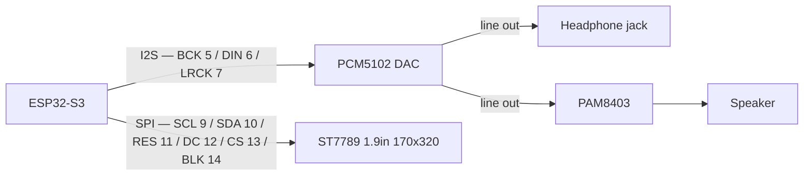

# Pocket Groovebox — Wiring

> 🚧 **Draft — provisional, pending bench tests.** Pin choices may change.

How the modules connect to the ESP32-S3. This doc is **only the connection structure** — each module's own specs and pinout live in [modules/](modules/). Pin choices follow the verified-safe 3.3 V GPIO pool documented in [modules/esp32-s3-devkit.md](modules/esp32-s3-devkit.md#gpio-usage-n32r16v).

## Connection overview

## Connections

### PCM5102 — I2S DAC

| ESP32-S3 | PCM5102 |
| --- | --- |
| GPIO5 | BCK (bit clock) |
| GPIO6 | DIN (data) |
| GPIO7 | LRCK / WS |
| 3V3 | VIN / VCC |
| GND | GND |

DAC and display both live on the **left header** — the only side with enough usable GPIOs (the right header has just 3: 1/2/21). BCK·DIN·LCK = GPIO **5·6·7**, same order as the module's header so the wires run straight across; SCK ties to GND. 3V3 and GND are both on the left header, so no power wire has to cross.

Module config: tie **SCK → GND** (internal PLL); set the FLT / DEMP / FMT / XSMT jumpers per the breakout (⚠️ our board's H/L labels are inverted — see [modules/pcm5102.md](modules/pcm5102.md#config-jumpers-solder-pads-back-of-board)).

### ST7789 — 1.9" 170×320 SPI display

| ESP32-S3 | ST7789 |
| --- | --- |
| GPIO9 | SCL / SCLK |
| GPIO10 | SDA / MOSI |
| GPIO11 | RES / RST |
| GPIO12 | DC |
| GPIO13 | CS |
| GPIO14 | BLK (backlight) |
| 3V3 | VCC |
| GND | GND |

GPIO **9–14**, assigned in the screen's own header order (SCL·SDA·RES·DC·CS·BLK) so the wires run straight across. SPI is fully remappable on the S3, so the order is a free choice. DAC sits just above at 5/6/7.

Write-only — no MISO. The 170×320 panel needs a driver offset (Arduino_GFX / TFT_eSPI).

### Still to assign

Keyboard (13 keys) and 2× EC11 encoders — pins TBD. Still free: left header GPIO **4, 8, 15, 16, 17, 18** plus right header **1, 2, 21**. Note GPIO9 is used by the display (SCL), so the I2C default of 8/9 would need remapping if an expander is added.
